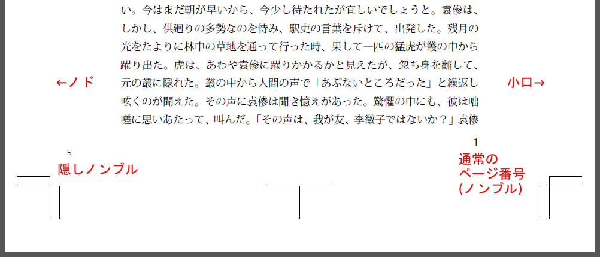
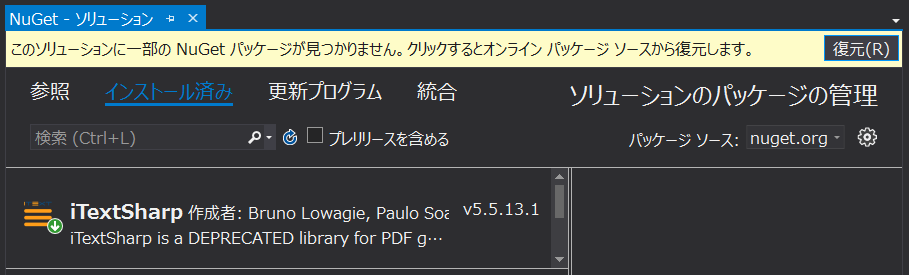

# blindfolio
PDFに隠しノンブルを追加するコマンドラインツール (Windows用)

## 隠しノンブルとは
製本すると見えにくくなるようにノド側に入れるページ番号。印刷所によっては必要な場合があります。大扉からの通し番号を振るので通常のページ番号とは一致しない場合があります。



## 使い方

```
blindfolio inputfile outputfile foot gutter start size
```

* inputfile : 入力ファイル名
* outputfile : 出力ファイル名
* foot : 地(下辺)からのオフセット位置 (単位はmm)
* gutter : ノド(内側の辺)からのオフセット位置 (単位はmm)
* start : ノンブルの開始番号
* size : ノンブルのフォントサイズ (単位はpt)

## 例
```
blindfolio input.pdf output.pdf 30 20 1 8
```
input.pdfに、地から30mm、ノドから20mmの位置に1から始まる隠しノンブルを6ptのフォントで記入し、output.pdfとして出力します。

## 実行バイナリ
Visual Studioでビルドするか、下記からダウンロードし、適当な場所にコピーして使ってください。
* https://github.com/lipoyang/blindfolio/releases

## 依存ライブラリ
* [iTextSharp](https://www.nuget.org/packages/iTextSharp/)

Visual Studioでソリューションを開き、「ツール」→「NuGetパッケージマネージャ」→「ソリューションのNuGetパッケージの管理」で「復元」をクリックするとiTextSharpがソリューションにインストールされます。



## 補足
本ツールを使わなくても、組版ツール Re:VIEW (バージョン3以降)には、隠しノンブルを入れる機能があります。ただし、通常のページ番号も大扉からの通し番号にする必要があります。下記の記事を参考にしてください。

* [Re:VIEW 3 からの LaTeX 処理 &mdash; Re:VIEW knowledge  ドキュメント](https://review-knowledge-ja.readthedocs.io/ja/latest/latex/review3-latex.html)
